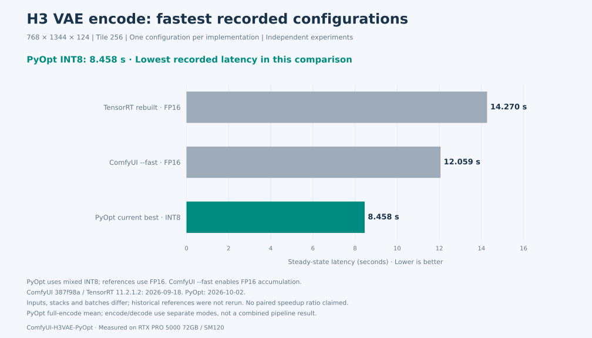
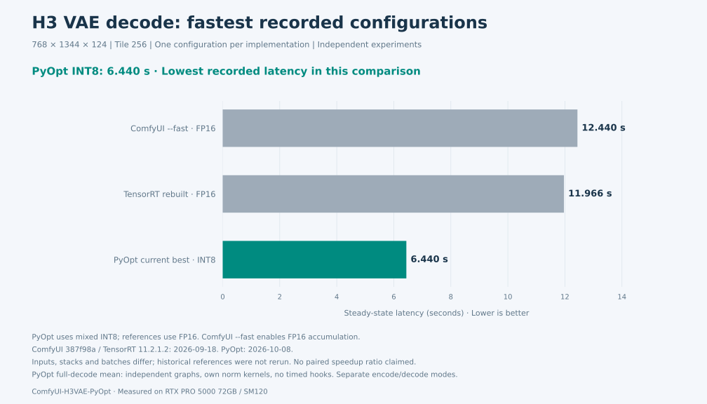

# ComfyUI-H3VAE-PyOpt

[](https://github.com/fishelegs/ComfyUI-H3VAE-PyOpt/actions/workflows/ci.yml)
[](https://github.com/fishelegs/ComfyUI-H3VAE-PyOpt/releases/latest)
[](LICENSE)

[English](#english) · [简体中文](#chinese)

<a id="english"></a>

**Faster MiniMax H3 video VAE, ready for ComfyUI.**

In the archived RTX PRO 5000 72GB comparisons below, **PyOpt has the fastest recorded encode and decode times: 8.458 s / 6.667 s**. Powered by PyTorch and Triton, it replaces one Loader while keeping your existing `VAE Encode` / `VAE Decode` nodes. No TensorRT engine required.

FP16 by default; optional INT8 acceleration.

[Performance](#performance) · [Modes and settings](#comfyui-usage) · [Installation](#quick-start) · [Quality](#quality-and-validation) · [Optimization history](#optimization-history) · [Reproduce](#benchmarking)

## Why use this repository?

- **Faster H3 VAE inference.** At the recorded GPU, 768×1344×124 input and tile256 settings, the fastest PyOpt INT8 encode/decode paths have lower latency than the measured ComfyUI `--fast` and TensorRT configurations. The fastest measured decoder that retains FP16 runs in **10.923 s**.
- **Fits existing workflows.** `H3VAEPyOptLoader` outputs a standard ComfyUI VAE for the native encode/decode nodes, with support for ComfyUI CPU offload and CUDA reload.
- **No engines to build or maintain.** Load the original model code and safetensors weights directly. Optimizations use `torch.compile` and Triton, without ONNX export, TensorRT engine builds or checkpoint conversion.

“Fastest” means **the lowest recorded latency among the versions, workloads and tested configurations listed here**. Reference results and current PyOpt results come from separate experiments, and INT8 involves a quality trade-off. Conditions and sources are provided below. The latest optimizations are not included in a tagged release; each benchmark records its source revision or file hashes.

## Performance

**Workload: RTX PRO 5000 72GB · 768×1344×124 frames · encoder/decoder tile256.** All times below measure the full VAE stage after warmup, excluding loading, initial compilation and media I/O. They do not measure the entire video generation workflow.

### Comparison with ComfyUI and TensorRT

Each chart shows **one fastest archived configuration per implementation at this workload**: ComfyUI with `--fast fp16_accumulation`, TensorRT with a locally rebuilt tile256 engine from the same weights, and PyOpt with its current fastest INT8 path. Earlier PyOpt versions, slower configurations and engines with different tile sizes are kept out of these charts.





| Implementation / fastest tested configuration | Encode | Decode | Measurement source |
| --- | ---: | ---: | --- |
| ComfyUI `387f98a` + `--fast fp16_accumulation` | 12.059 s | 12.440 s | [2026-09-18](docs/h3_latest_fast_ab_2026-09-18.md) |
| TensorRT 11.2.1.2, FP16 engine rebuilt from the same weights | 14.270 s | 11.966 s | [2026-09-18](docs/h3_trt_256_same_tile_benchmark_2026-09-18.md) |
| **PyOpt INT8: fastest encode / decode modes selected separately** | **8.458 s** | **6.667 s** | [Encode · 2026-10-02](docs/int8_causal_zero_2026-10-02.md) / [Decode · 2026-09-24](docs/decode_fusions.md) |

This table summarizes the **fastest tested configurations from separate experiments**. The reference implementations use historical versions and builds; inputs, software stacks, batch sizes, precision and background GPU load also differ. We therefore do not infer a percentage speedup over competitors from these records. PyOpt's two best times use different modes and **must not be added together as a measured encode＋decode total**.

[Chart data and configurations](docs/benchmarks/current_competitor_comparison_2026-10-02.json) · [Chart generator](scripts/render_benchmark_charts.py) · [Plan for a unified comparison](docs/benchmarks/unified-comparison.md)

### Current fastest tested PyOpt modes

| Goal | Mode | Current latency | Key settings |
| --- | --- | ---: | --- |
| **Faster encode** | INT8 encoder with normalization recomputation and causal-zero skipping | **8.458 s** | `int8_encode=true`, `decode_fusions=false`, staged batch4 |
| **Faster decode** | Fused INT8 decoder, 144 INT8 Linear layers | **6.667 s** | `int8_decode=true`, `decode_fusions=true`, tile batch4 |
| **Fast decode with FP16** | Fused FP16 decoder | **10.923 s** | `int8_decode=false`, `decode_fusions=true`, tile batch8 |

These are **steady-state means for the fastest tested configurations**, not individual minimum samples. The latest paired encode comparison measured **8.683 → 8.458 s (2.59% lower latency)** with unchanged peak allocated memory. It skips convolution products from the two known-zero causal padding planes without changing quantization or rounding. FP16 remains the default; settings for all three accelerated modes are below.

## Quick start

You need an NVIDIA CUDA GPU, compatible PyTorch/Triton versions, and the MiniMax H3 `FL2VA/video_vae` model code and safetensors weights. Install using **ComfyUI's own Python environment**:

```bash
cd /path/to/ComfyUI/custom_nodes
git clone https://github.com/fishelegs/ComfyUI-H3VAE-PyOpt.git
cd /path/to/ComfyUI
python -m pip install -r custom_nodes/ComfyUI-H3VAE-PyOpt/requirements.txt
```

Prefer the PyTorch installation already used by ComfyUI and matched to your CUDA environment. Set the model locations, then restart ComfyUI:

```bash
export H3_VAE_MODEL_CODE_DIR=/path/to/MiniMax-H3/FL2VA/video_vae
export H3_VAE_WEIGHTS_PATH=/path/to/minimax_h3_video_vae_fp16.safetensors
```

Alternatively, put the weights in `ComfyUI/models/vae` and select them in the Loader. The model code directory still needs to be configured.

For the **INT8 decoder**, also install its pinned dependency:

```bash
python -m pip install 'comfy-kitchen==0.2.34'
```

This repository does not distribute model code, weights or engines. Model use is subject to the [MiniMax H3 Community License](https://huggingface.co/MiniMaxAI/MiniMax-H3/blob/main/LICENSE).

## ComfyUI usage

Search for **MiniMax H3 VAE Load (PyTorch Optimized)** (`H3VAEPyOptLoader`) and connect its `VAE` output to your existing `VAE Encode` / `VAE Decode` nodes.

Start with the Loader defaults to confirm your workflow works. To reproduce the fastest configurations above, use `dtype=fp16`, `compile_encoder=true`, `compile_decoder=true` and `fast_linear=false`, then select a column below:

| Parameter | Fastest INT8 encode | Fastest INT8 decode | Fastest FP16 decode |
| --- | --- | --- | --- |
| `int8_encode` | `true` | `false` | `false` |
| `int8_decode` | `false` | `true` | `false` |
| `decode_fusions` | `false` | `true` | `true` |
| `encoder_tile_size` / `decoder_tile_size` | `256` / `256` | `256` / `256` | `256` / `256` |
| `encoder_staged_batch` | `4` | `4` | `4` |
| `tile_batch` | `2` | `4` | `8` |

**INT8 encoding cannot currently be combined with a fused decoder.** Both decoder modes above use an FP16 encoder. Combining INT8 encoding with `int8_decode=true` uses the unfused decoder and does not reproduce the 6.667 s result.

The latest encoder scheduling optimizations are enabled automatically only on **SM120**. INT8 and decoder fusion require NVIDIA CUDA SM80+ as a baseline; fused decoding also requires FP32 normalization, which is enabled by default. Windows, performance on other GPUs and their memory requirements have not received equivalent validation; BF16 is not integrated. Initial compilation can take time. Set the Loader's `warmup` to `decode` or `both` to warm up during loading. Recheck quality and memory use after changing tile or batch sizes.

[Configuration and compatibility](docs/compatibility.md) · [Decoder fusion details](docs/decode_fusions.md) · [INT8 behavior and limitations](docs/experimental_int8.md)

### Minimal workflows

- [Fused INT8 decode](examples/minimal_h3vae_pyopt_int8_fused_prompt.json) / [Fused FP16 decode](examples/minimal_h3vae_pyopt_fp16_fused_prompt.json).
- [INT8 image encode→decode](examples/minimal_h3vae_pyopt_int8_roundtrip_prompt.json): upload a 256×256 image, then replace the example filename and model paths.
- [Default FP16 decode](examples/minimal_h3vae_pyopt_prompt.json).

These examples use the ComfyUI **API format**. After updating paths, submit one to your local server:

```bash
curl -sS -X POST http://127.0.0.1:8188/prompt \
  -H 'Content-Type: application/json' \
  --data-binary @examples/minimal_h3vae_pyopt_int8_fused_prompt.json
```

The decode examples use zero latents to demonstrate node connections; they do not demonstrate generated image quality.

## Quality and validation

INT8 uses lossy mixed precision: its speed comes with quantization error. FP16 fusion can also change rounding order, and FP16 VAE reconstruction is not lossless.

Decoder reconstruction was tested on 8 real videos totaling 992 frames, using the same FP16 encoder for both modes. The PSNR values below compare reconstructed RGB before video compression against the source video:

| Decoder mode | Mean per-frame PSNR | Worst-frame PSNR | Frames below 30 dB |
| --- | ---: | ---: | ---: |
| Fused FP16 | 35.110 dB | 32.709 dB | 0 / 992 |
| Fused INT8 | 34.940 dB | 32.587 dB | 0 / 992 |

In a separate paired test, the INT8 **encoder** reduced mean source-reconstruction PSNR by approximately **0.623 dB** relative to the FP16 encoder. The latest causal-zero optimization preserved bitwise-identical INT8 latents on 8 videos, with RGB equality additionally checked on one full 124-frame video. It introduced no additional INT8 error in these checks.

The ComfyUI wrapper and CPU offload/CUDA reload have been validated; quality and timing results are recorded separately. These results apply to the tested media. Passing 30 dB does not guarantee identical detail, seams or temporal behavior on arbitrary videos. [Decoder quality evidence](docs/decode_fusions.md#quality-and-integration) · [Latest encoder validation](docs/int8_causal_zero_2026-10-02.md) · [INT8 quality trade-offs](docs/experimental_int8.md)

## Optimization history

Earlier iterations are collected here; competitor charts show only the current fastest configurations. Each row below is an independent experiment. Percentages refer only to that row's baseline and must not be compounded across experiments.

### INT8 encoder history

| Date / stage | Paired encode comparison | Latency reduction | Report |
| --- | ---: | ---: | --- |
| 2026-10-02 · Convolution tiling + dynamic quantization | 12.545 → 10.121 s | 19.32% | [Implementation and FP16 comparison](docs/encoder_int8_optimization_2026-10-02.md) |
| 2026-10-02 · Four-stage convolution pipeline | 10.120 → 9.505 s | 6.07% | [Nsight hotspots and A/B](docs/int8_nsys_optimization_2026-10-02.md) |
| 2026-10-02 · norm/absmax fusion | 9.506 → 9.138 s | 3.87% | [Numerical and memory validation](docs/int8_norm_producer_2026-10-02.md) |
| 2026-10-02 · Recompute and write INT8 directly | 9.140 → 8.684 s | 4.99% | [Recomputation evidence](docs/int8_norm_recompute_2026-10-02.md) |
| **2026-10-02 · Skip causal-zero convolution taps** | **8.683 → 8.458 s** | **2.59%** | [Latest implementation and evidence](docs/int8_causal_zero_2026-10-02.md) |

### Decoder history

| Date / stage | Measured decode | Notes |
| --- | ---: | --- |
| 2026-09-22 · v0.2.0 INT8 | 8.278 s | 72 INT8 Linear layers, batch2; paired FP16 result: 11.477 s, [27.9% lower latency](docs/experimental_int8.md#historical-v020-performance-four-way-comparison) |
| **2026-09-24 · FP16 / INT8 fusion** | **10.923 / 6.667 s** | FP16 batch8 / INT8 with 144 Linear layers, batch4; [current fastest validated configurations](docs/decode_fusions.md) |
| 2026-10-02 · GEMM scheduling replay | No new change adopted | Candidates did not consistently outperform existing CUTLASS; [unsuccessful experiments retained](docs/int8_norm_producer_2026-10-02.md) |
| 2026-10-02 · GEMM＋SwiGLU fusion / FP16 finalizer replay | No new change adopted | Local gains were not established as full-decode improvements; [numerical gates and findings](docs/int8_causal_zero_2026-10-02.md#其他候选与剩余空间) |

Earlier comparisons and other workloads: [ComfyUI runtime](docs/h3_spatial_encoder_followup_2026-09-17.md) · [ComfyUI fast](docs/h3_latest_fast_ab_2026-09-18.md) · [TensorRT with matching tiles](docs/h3_trt_256_same_tile_benchmark_2026-09-18.md) · [Historical 368/672 tile benchmarks](docs/h3_same_tile_ab_benchmark_2026-09-16.md)

## Benchmarking

Benchmark the current fused INT8 decoder without TensorRT:

```bash
python bench_pyopt_vs_trt.py --pyopt-only --decode-fusions --int8-decode \
  --model-code-dir "$H3_VAE_MODEL_CODE_DIR" --weights "$H3_VAE_WEIGHTS_PATH" \
  --height 768 --width 1344 --frames 124 \
  --decoder-tile 256 --encoder-tile 256 --tile-batch 4 --staged-batch 4 \
  --warmup 2 --runs 5 --seed 20260924 \
  --output results/int8_fused_768.json
```

For the fused FP16 decoder, remove `--int8-decode`, use `--tile-batch 8` and change the output filename. Timing includes dynamic quantization and output processing.

[Latest encoder A/B commands](docs/int8_causal_zero_2026-10-02.md#复现) · [Real-video quality and four-way comparison](docs/experimental_int8.md#reproduce) · [Unified comparison plan (not yet executed)](docs/benchmarks/unified-comparison.md)

Regenerate the charts from the repository's recorded numerical evidence without running the model:

```bash
python scripts/render_benchmark_charts.py --current-only
```

## Contributing and compatibility

[Contributing guide](CONTRIBUTING.md) · [CPU CI and GPU validation boundaries](docs/testing.md) · [Tested compatibility](docs/compatibility.md)

Use the **Benchmark report** issue template to contribute performance and quality results for other GPUs. Include the environment, configuration and raw timings.

## License

Repository-authored code is [MIT-licensed](LICENSE). ComfyUI, PyTorch, Triton,
safetensors, optional comfy-kitchen, and MiniMax H3 model code/weights retain
their respective licenses. This repository does not include or relicense
MiniMax H3 model code or weights. See [THIRD_PARTY_NOTICES.md](THIRD_PARTY_NOTICES.md).

---

<a id="chinese"></a>

## 简体中文

[English](#english) · [简体中文](#chinese)

**更快的 MiniMax H3 视频 VAE，直接接入 ComfyUI。**

在下方已归档的 RTX PRO 5000 72GB 对比中，**最快的 encode 和 decode 记录均来自 PyOpt：8.458 秒 / 6.667 秒**。使用 PyTorch/Triton 加速，替换一个 Loader 即可沿用原有 `VAE Encode` / `VAE Decode` 节点，无需 TensorRT engine。

默认使用 FP16，可选 INT8 加速。

[性能对比](#性能) · [最新模式与配置](#comfyui-用法) · [安装](#快速开始) · [画质](#画质与验证) · [优化迭代](#优化迭代) · [复现](#直接测试)

## 为什么使用这个仓库

- **让 H3 VAE 更快。** 在已记录的同 GPU、768×1344×124、tile256 配置中，最快 PyOpt INT8 路径的 encode/decode 耗时均低于已测 ComfyUI `--fast` 和 TensorRT 记录；保留 FP16 精度的最快已测 decoder 为 **10.923 秒**。
- **直接接入现有工作流。** 一个 `H3VAEPyOptLoader` 输出标准 ComfyUI VAE，继续使用原生编码、解码节点；支持 ComfyUI CPU offload/CUDA reload。
- **无需构建和维护 engine。** 直接加载原始模型代码与 safetensors 权重，通过 `torch.compile` 和 Triton 完成优化，不需要 ONNX 导出、TensorRT 构建或 checkpoint 转换。

“最快”指**本页列出的版本、规格和已测配置中的最低记录**。竞品数据与最新 PyOpt 来自不同轮次，INT8 也有精度取舍；测试条件和来源见下文。最新优化尚未包含在带标签的 release 中，各测试记录了对应的源码版本或文件哈希。

## 性能

**测试规格：RTX PRO 5000 72GB · 768×1344×124 帧 · encoder/decoder tile256。** 以下均为预热后的完整 VAE 阶段耗时，排除加载、首次编译和媒体 I/O，不代表整条视频生成流程的耗时。

### 与 ComfyUI、TensorRT 对比

图中**每个实现只保留该规格下已归档的最快配置**：ComfyUI 使用 `--fast fp16_accumulation`，TensorRT 使用本机同权重重建的 tile256 engine，PyOpt 使用当前最快的 INT8 路径。旧版 PyOpt、较慢配置和不同 tile 的 engine 不放进竞品图。


| 实现 / 最快已测配置 | Encode | Decode | 测量来源 |
| --- | ---: | ---: | --- |
| ComfyUI `387f98a` + `--fast fp16_accumulation` | 12.059 s | 12.440 s | [2026-09-18](docs/h3_latest_fast_ab_2026-09-18.md) |
| TensorRT 11.2.1.2，同权重重建 FP16 engine | 14.270 s | 11.966 s | [2026-09-18](docs/h3_trt_256_same_tile_benchmark_2026-09-18.md) |
| **PyOpt INT8：分别选择最快 encode / decode 模式** | **8.458 s** | **6.667 s** | [Encode · 2026-10-02](docs/int8_causal_zero_2026-10-02.md) / [Decode · 2026-09-24](docs/decode_fusions.md) |

这是**已测最快配置的汇总，不是全表同轮 A/B**。竞品是历史版本与构建记录；输入、软件栈、batch、精度和后台负载也存在差异，因此不据此计算“比竞品快 X%”。PyOpt 的两个最优时间来自不同模式，**不能相加成一个已测的 encode＋decode 总时间**。

[图表数据与配置](docs/benchmarks/current_competitor_comparison_2026-10-02.json) · [绘图脚本](scripts/render_benchmark_charts.py) · [统一竞品复测方案](docs/benchmarks/unified-comparison.md)

### 本仓库当前最快的已测模式

| 目标 | 模式 | 当前耗时 | 关键配置 |
| --- | --- | ---: | --- |
| **更快 encode** | INT8 encoder，重算 norm 并跳过因果零卷积 | **8.458 s** | `int8_encode=true`，`decode_fusions=false`，staged batch4 |
| **更快 decode** | INT8 decoder 融合，144 个 INT8 Linear | **6.667 s** | `int8_decode=true`，`decode_fusions=true`，tile batch4 |
| **保留 FP16 的快速 decode** | FP16 decoder 融合 | **10.923 s** | `int8_decode=false`，`decode_fusions=true`，tile batch8 |

这些数字是最快已测**配置的稳态均值**，不是挑选单次最小值。最新 encode 的同轮对照为 **8.683 → 8.458 s（耗时降低 2.59%）**，峰值 allocated 不变；通过跳过前两帧因果 padding 中已知为零的卷积乘积提速，量化和舍入规则保持不变。默认仍为 FP16，三个加速模式的具体开关见下方。

## 快速开始

需要 NVIDIA CUDA GPU、兼容的 PyTorch/Triton，以及 MiniMax H3 的 `FL2VA/video_vae` 模型代码和 safetensors 权重。使用 **ComfyUI 自己的 Python 环境**安装：

```bash
cd /path/to/ComfyUI/custom_nodes
git clone https://github.com/fishelegs/ComfyUI-H3VAE-PyOpt.git
cd /path/to/ComfyUI
python -m pip install -r custom_nodes/ComfyUI-H3VAE-PyOpt/requirements.txt
```

优先沿用 ComfyUI 已安装、与本机 CUDA 匹配的 PyTorch。设置模型位置后重启 ComfyUI：

```bash
export H3_VAE_MODEL_CODE_DIR=/path/to/MiniMax-H3/FL2VA/video_vae
export H3_VAE_WEIGHTS_PATH=/path/to/minimax_h3_video_vae_fp16.safetensors
```

权重也可以放在 `ComfyUI/models/vae`，然后在 Loader 中选择；模型代码目录仍需设置。

使用 **INT8 decoder** 时，额外安装其固定版本依赖：

```bash
python -m pip install 'comfy-kitchen==0.2.34'
```

本仓库不分发模型代码、权重或 engine。模型使用须遵守 [MiniMax H3 Community License](https://huggingface.co/MiniMaxAI/MiniMax-H3/blob/main/LICENSE)。

## ComfyUI 用法

搜索 **MiniMax H3 VAE Load (PyTorch Optimized)**（`H3VAEPyOptLoader`），把它的 `VAE` 输出连接到现有 `VAE Encode` / `VAE Decode` 节点。

首次使用可保持 Loader 默认配置，先确认工作流正常。要复现上方最快配置，公共设置为 `dtype=fp16`、`compile_encoder=true`、`compile_decoder=true`、`fast_linear=false`，并按表选择：

| 参数 | 最快 INT8 encode | 最快 INT8 decode | 最快 FP16 decode |
| --- | --- | --- | --- |
| `int8_encode` | `true` | `false` | `false` |
| `int8_decode` | `false` | `true` | `false` |
| `decode_fusions` | `false` | `true` | `true` |
| `encoder_tile_size` / `decoder_tile_size` | `256` / `256` | `256` / `256` | `256` / `256` |
| `encoder_staged_batch` | `4` | `4` | `4` |
| `tile_batch` | `2` | `4` | `8` |

**INT8 encoder 暂不能与融合 decoder 同时开启。** 上表两个 decoder 模式均使用 FP16 encoder；INT8 encoder 若搭配 `int8_decode=true`，使用的是非融合 decoder，不对应 6.667 秒的记录。

Encoder 的最新调度只在 **SM120** 自动启用；INT8 和 decoder 融合的基础要求为 NVIDIA CUDA SM80+。融合 decoder 还要求 FP32 normalization（默认开启）。Windows、其他 GPU 的性能及显存需求尚未完成同等验证；BF16 未接入。首次编译可能较慢，可用 Loader 的 `warmup=decode` 或 `both` 在加载时预热。改变 tile 或 batch 后应复查画质和显存。

[配置与兼容性](docs/compatibility.md) · [Decoder 融合说明](docs/decode_fusions.md) · [INT8 合同与限制](docs/experimental_int8.md)

### 最小工作流

- [INT8 融合 decode](examples/minimal_h3vae_pyopt_int8_fused_prompt.json) / [FP16 融合 decode](examples/minimal_h3vae_pyopt_fp16_fused_prompt.json)。
- [INT8 图片 encode→decode](examples/minimal_h3vae_pyopt_int8_roundtrip_prompt.json)：先上传 256×256 图片，再替换示例文件名和模型路径。
- [默认 FP16 decode](examples/minimal_h3vae_pyopt_prompt.json)。

这些是 ComfyUI **API 格式**示例。修改路径后可提交到本地服务：

```bash
curl -sS -X POST http://127.0.0.1:8188/prompt \
  -H 'Content-Type: application/json' \
  --data-binary @examples/minimal_h3vae_pyopt_int8_fused_prompt.json
```

Decode 示例使用全零 latent，只演示节点连接，不代表生成画质。

## 画质与验证

INT8 是有损混合精度，速度优势伴随量化误差。FP16 融合也可能改变舍入顺序，不能把“FP16”理解为 VAE 重建无损。

8 段真实视频、共 992 帧的 decoder 重建测试，两条路径均使用相同 FP16 encoder；以下 PSNR 对比视频压缩前的 RGB 与原视频：

| Decoder 模式 | 平均逐帧 PSNR | 最差帧 PSNR | 低于 30 dB |
| --- | ---: | ---: | ---: |
| FP16 融合 | 35.110 dB | 32.709 dB | 0 / 992 |
| INT8 融合 | 34.940 dB | 32.587 dB | 0 / 992 |

INT8 **encoder** 在单独的同轮测试中，相比 FP16 encoder 的源重建平均 PSNR 低约 **0.623 dB**。最新因果零卷积优化保持 8 段视频的 INT8 latent 逐位一致，并另对一段完整 124 帧视频复查了 RGB 一致，未增加这些检查中的原有 INT8 误差。

ComfyUI wrapper 和 CPU offload/CUDA reload 已验证；精度与性能测试分开记录。上述结果限于已测素材，30 dB 通过不代表任意视频的细节、接缝或时序完全一致。[Decoder 画质证据](docs/decode_fusions.md#quality-and-integration) · [Encoder 最新验证](docs/int8_causal_zero_2026-10-02.md) · [原有 INT8 画质取舍](docs/experimental_int8.md)

## 优化迭代

这里保留版本演进；竞品图只展示当前最快配置。下表每行是独立实验，百分比只针对该行基线，不能跨轮串联。

### INT8 encoder

| 日期 / 阶段 | 同轮 encode 对照 | 耗时降低 | 记录 |
| --- | ---: | ---: | --- |
| 2026-10-02 · 卷积 tile＋动态量化 | 12.545 → 10.121 s | 19.32% | [实现与 FP16 对照](docs/encoder_int8_optimization_2026-10-02.md) |
| 2026-10-02 · 四级卷积流水线 | 10.120 → 9.505 s | 6.07% | [Nsight 热点与 A/B](docs/int8_nsys_optimization_2026-10-02.md) |
| 2026-10-02 · norm/absmax 融合 | 9.506 → 9.138 s | 3.87% | [数值与显存验证](docs/int8_norm_producer_2026-10-02.md) |
| 2026-10-02 · 重算并直接写 INT8 | 9.140 → 8.684 s | 4.99% | [重算优化证据](docs/int8_norm_recompute_2026-10-02.md) |
| **2026-10-02 · 跳过因果零卷积** | **8.683 → 8.458 s** | **2.59%** | [最新实现与证据](docs/int8_causal_zero_2026-10-02.md) |

### Decoder

| 日期 / 阶段 | 已测 decode | 说明 |
| --- | ---: | --- |
| 2026-09-22 · v0.2.0 INT8 | 8.278 s | 72 个 INT8 Linear、batch2；同轮 FP16 为 11.477 s，[耗时降低 27.9%](docs/experimental_int8.md#historical-v020-performance-four-way-comparison) |
| **2026-09-24 · FP16 / INT8 融合** | **10.923 / 6.667 s** | FP16 batch8 / INT8 144 个 Linear、batch4；[当前最快已验证配置](docs/decode_fusions.md) |
| 2026-10-02 · GEMM 调度回放 | 未采用新改动 | 候选没有稳定胜过现有 CUTLASS，[保留失败实验](docs/int8_norm_producer_2026-10-02.md) |
| 2026-10-02 · GEMM＋SwiGLU 融合 / FP16 finalizer 回放 | 未采用新改动 | 局部收益尚未验证为完整 decode 提升，[数值门禁与实验结论](docs/int8_causal_zero_2026-10-02.md#其他候选与剩余空间) |

早期对比与其他规格：[ComfyUI runtime](docs/h3_spatial_encoder_followup_2026-09-17.md) · [ComfyUI fast](docs/h3_latest_fast_ab_2026-09-18.md) · [同 tile TensorRT](docs/h3_trt_256_same_tile_benchmark_2026-09-18.md) · [368/672 tile 历史基准](docs/h3_same_tile_ab_benchmark_2026-09-16.md)

## 直接测试

测当前 INT8 融合 decoder，不需要 TensorRT：

```bash
python bench_pyopt_vs_trt.py --pyopt-only --decode-fusions --int8-decode \
  --model-code-dir "$H3_VAE_MODEL_CODE_DIR" --weights "$H3_VAE_WEIGHTS_PATH" \
  --height 768 --width 1344 --frames 124 \
  --decoder-tile 256 --encoder-tile 256 --tile-batch 4 --staged-batch 4 \
  --warmup 2 --runs 5 --seed 20260924 \
  --output results/int8_fused_768.json
```

测 FP16 融合 decoder：去掉 `--int8-decode`，改为 `--tile-batch 8` 并更换输出文件名。动态量化和输出处理包含在计时中。

[最新 encoder A/B 命令](docs/int8_causal_zero_2026-10-02.md#复现) · [真实视频质量与四路比较](docs/experimental_int8.md#reproduce) · [统一竞品复测方案（待执行）](docs/benchmarks/unified-comparison.md)

图表使用仓库内的数值证据生成，无需运行模型：

```bash
python scripts/render_benchmark_charts.py --current-only
```

## 贡献与兼容性

[贡献指南](CONTRIBUTING.md) · [CPU CI 与 GPU 验证边界](docs/testing.md) · [已测兼容性](docs/compatibility.md)

欢迎通过 Issue 的 **Benchmark report** 模板补充其他 GPU 的性能与画质数据，请同时提供环境、配置和原始计时。

## 许可证

本仓库自行编写的代码采用 [MIT 许可证](LICENSE)。ComfyUI、PyTorch、Triton、safetensors、可选的 comfy-kitchen，以及 MiniMax H3 模型代码和权重均保留各自的许可证。本仓库不包含 MiniMax H3 模型代码或权重，也不为它们重新授权。详见 [第三方声明](THIRD_PARTY_NOTICES.md)。
