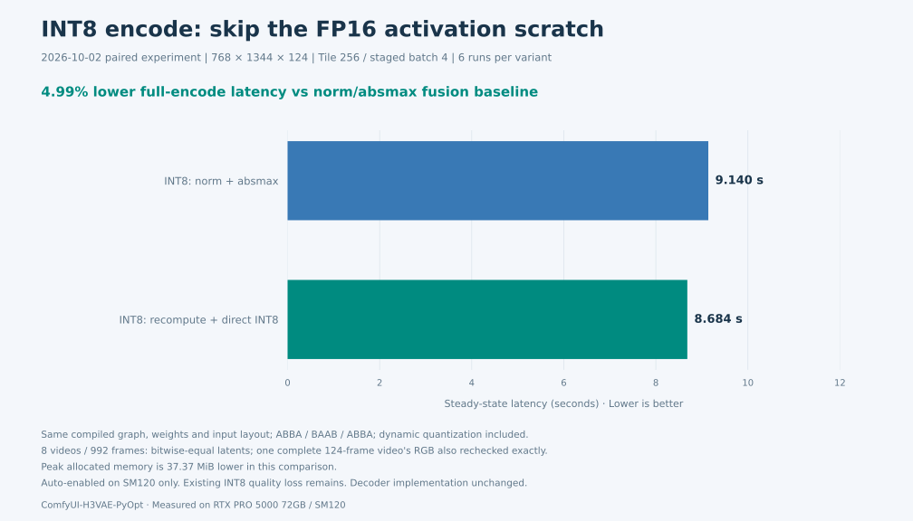
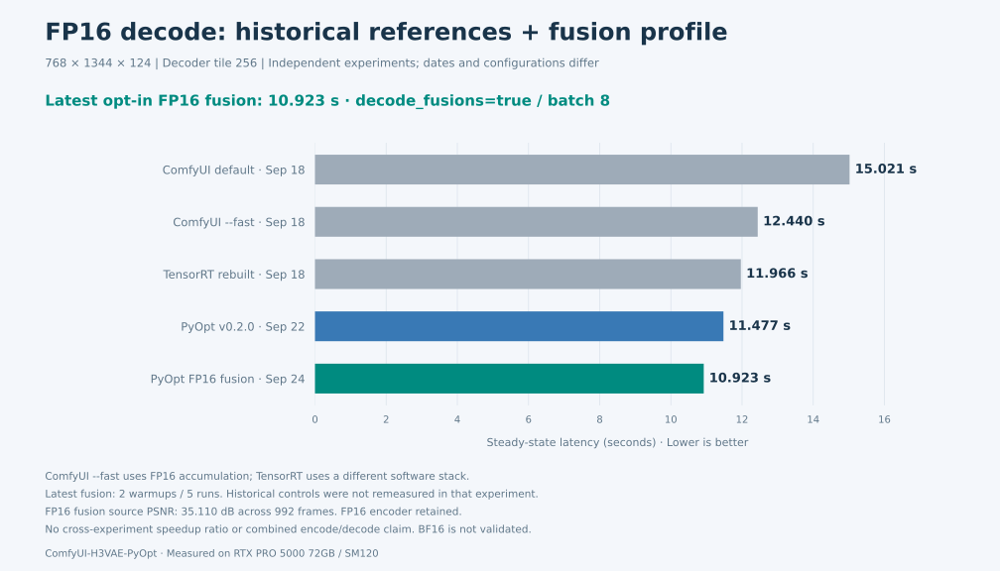
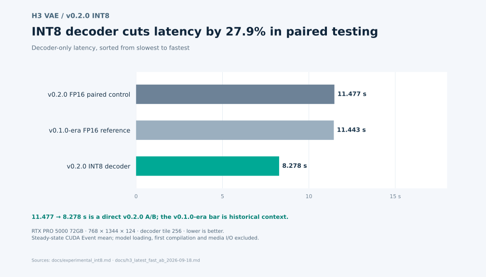
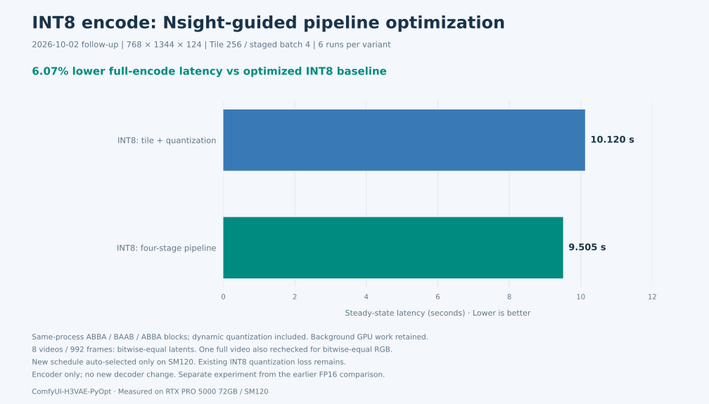
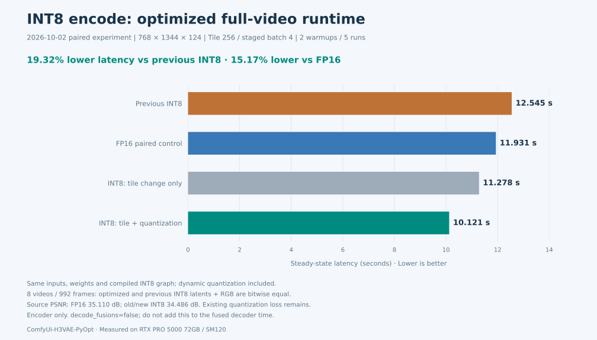

# ComfyUI-H3VAE-PyOpt

[](https://github.com/fishelegs/ComfyUI-H3VAE-PyOpt/actions/workflows/ci.yml)
[](https://github.com/fishelegs/ComfyUI-H3VAE-PyOpt/releases/latest)
[](LICENSE)

**MiniMax H3 视频 VAE 的 ComfyUI 替换式 Loader。**沿用原生 `VAE Encode` / `VAE Decode` 节点，使用经过验证的 FP16 PyTorch/Triton 路径；可独立开启实验性 INT8 encoder / decoder。日常运行不需要 TensorRT engine。

*An optimized PyTorch/Triton VAE loader for MiniMax H3 in ComfyUI. The FP16 path is the default; INT8 encode and decode are opt-in.*

| 模式 | 适合谁 | 已测结果（768×1344×124） |
| --- | --- | --- |
| **FP16 默认** | 优先使用经过验证的浮点路径 | 第一轮 encode 对照为 11.931 s；v0.2.0 decode 为 11.477 s（不同轮次，分开报告） |
| **INT8 encoder（最新优化）** | 愿意接受 encoder 量化误差、希望降低 encode 延迟 | Encode **8.684 s**；重算并直接写 INT8，比上一版再低 **4.99%**，峰值显存减少约 **37 MiB**。保留原 INT8 精度取舍，[测量与限制](docs/int8_norm_recompute_2026-10-02.md) |
| **FP16 encode + INT8 decoder** | 优先减少 decoder 耗时，并检查自己的素材画质 | v0.2.0 decode **8.278 s**；最新融合配置 **6.667 s**（不同轮次与配置）；融合版源重建平均 PSNR 34.940 dB |

数字来自 RTX PRO 5000 72GB 的预热后实测，性能与画质均受硬件、素材和配置影响。性能表包含尚未发布为 release 的开发结果。INT8 encode 需 `decode_fusions=false`；最新 decoder 融合需 `decode_fusions=true` 且 `int8_encode=false`，**8.684 s encode 与 6.667 s decode 不能组合为一个已测模式**。详见[性能与画质](#性能)。

### 为什么选择 PyOpt？

**已测优势：第一轮优化 INT8 encoder 比同轮 FP16 耗时低 15.17%；INT8 decoder 的 v0.2.0 同轮降幅为 27.9%，新融合配置另测得 6.667 s。** 同时沿用 ComfyUI 原有 VAE 节点，日常运行无需构建和分发 TensorRT engine。

| Decode 对比（768×1344×124） | 参照 → PyOpt | 耗时降低 | 证据范围 |
| --- | ---: | ---: | --- |
| ComfyUI 默认 → PyOpt FP16 | 15.021 → 11.443 s | **23.8%** | [2026-09-18 历史对照](docs/h3_latest_fast_ab_2026-09-18.md)，ComfyUI `387f98a`；PyOpt 为上一轮同口径结果 |
| ComfyUI `--fast fp16_accumulation` → PyOpt FP16 | 12.440 → 11.443 s | **8.0%** | 同上，各自独立进程测量 |
| TensorRT → PyOpt FP16 | 11.966 → 11.437 s | **4.4%** | [2026-09-18 同 tile 对照](docs/h3_trt_256_same_tile_benchmark_2026-09-18.md)，双方 tile 256；软件栈不同 |
| PyOpt FP16 → PyOpt INT8 decoder | 11.477 → 8.278 s | **27.9%** | [2026-09-22 同轮 A/B](docs/experimental_int8.md)，只开启 INT8 decode |

所有数字均来自 RTX PRO 5000 72GB，表示预热后的 **decode 耗时降低**，不代表整个视频生成流程的加速倍数。各行是独立实验，不能串联百分比；INT8 尚未与当前 ComfyUI / TensorRT 完成统一复测。

**怎么选：**默认 FP16 作为浮点基线。关注 encode 延迟可试 `int8_encode=true`、`decode_fusions=false`：最新优化在 8 段、992 帧上与上一版 INT8 的 latent 逐位一致，并另对一段完整视频复查了重建 RGB 一致，但相对 FP16 的源重建 PSNR 仍低约 **0.623 dB**。关注 decode 延迟可保持 FP16 encoder，尝试 INT8 decoder 或下方融合配置。各模式的质量数据分别报告；最新 encode 对照的峰值 allocated 减少约 37 MiB；尚未测冷启动收益。[统一复测方案与待补证据](docs/benchmarks/unified-comparison.md)。

**快速导航：**[安装与配置](#快速开始) · [性能与画质](#性能) · [节点用法](#comfyui-用法) · [复现基准](#直接测试) · [兼容性](docs/compatibility.md)

main 中尚未发布为 release 的 `decode_fusions=true` 配置及测量见下文最新 decode 表和[融合说明](docs/decode_fusions.md)。

> [!IMPORTANT]
> 当前经过验证并用于下列公开 benchmark 的浮点基线是 **FP16，不是 BF16**。这里的“浮点基线”表示没有额外的 INT8 量化；VAE encode→decode 本身是有损过程，因此本项目不使用“数学无损”表述。BF16 尚未接入和验证，不能将现有 FP16 数据标记为 BF16。

## 快速开始

需要 NVIDIA CUDA GPU、兼容的 PyTorch 与 Triton，以及与权重匹配的 MiniMax H3 `FL2VA/video_vae` 模型代码。本仓库不包含模型代码、权重或 TRT engine；模型使用须遵守 [MiniMax H3 Community License](https://huggingface.co/MiniMaxAI/MiniMax-H3/blob/main/LICENSE)。

在启动 ComfyUI 所用的 Python 环境中安装：

```bash
cd /path/to/ComfyUI/custom_nodes
git clone https://github.com/fishelegs/ComfyUI-H3VAE-PyOpt.git
cd /path/to/ComfyUI
python -m pip install -r custom_nodes/ComfyUI-H3VAE-PyOpt/requirements.txt
```

优先沿用 ComfyUI 已安装、与本机 CUDA 匹配的 PyTorch。设置模型路径后重启 ComfyUI：

```bash
export H3_VAE_MODEL_CODE_DIR=/path/to/MiniMax-H3/FL2VA/video_vae
export H3_VAE_WEIGHTS_PATH=/path/to/minimax_h3_video_vae_fp16.safetensors
```

权重也可放入 `ComfyUI/models/vae` 并在节点中选择；模型代码目录仍需设置。重启 ComfyUI 后，搜索 **MiniMax H3 VAE Load (PyTorch Optimized)**，将其 `VAE` 输出连接到原有的 `VAE Encode` / `VAE Decode`。首次使用建议保持 `dtype=fp16`、`int8_encode=false`、`int8_decode=false`。更多选项见[节点用法](#comfyui-用法)。

当前性能测试在 Linux 完成；Windows 需要匹配其 Python/PyTorch/CUDA 组合的 Triton，尚无本项目的实测兼容性结论。SDPA 默认 `auto`；强制指定后端可能失去自动回退。详见[兼容性与 SDPA 说明](docs/compatibility.md#sdpa-backend-fallback)。

## 性能

以下结果均在 **NVIDIA RTX PRO 5000 72GB** 上测得。性能数字均为预热后的稳态时间，不含加载、首次编译和 engine 初始化。

### Encode / decode 耗时图

Encoder 图来自 **2026-10-02 最新重算优化同轮 A/B**，decoder 两图包含标注日期的历史参照及 **2026-09-24 融合配置**。横轴均从零开始，单位为秒、越低越好；不同日期、batch 和配置的行不能直接当作同轮加速率。







Encode 图含动态量化，2 次预热、各 6 次交错测量；8 段视频 latent 逐位一致，另查一段完整视频 RGB 一致。Decode 融合版为 144 个 INT8 Linear、batch4，保持 FP16 encoder；它与历史 72 个 Linear、batch2 的 8.278 s 配置不同。历史竞品未在本轮重测，不据此计算新的跨批次加速率。[最新 Encoder 证据](docs/int8_norm_recompute_2026-10-02.md) · [Decode 融合证据](docs/decode_fusions.md) · [图表生成脚本](scripts/render_benchmark_charts.py)。

### 最新 decode：FP16 / INT8 / ComfyUI / TensorRT

同一台 RTX PRO 5000 72GB，视频规格 **768×1344×124**，单位为秒，越低越好。新实现通过现有 Loader 的 `decode_fusions=true` 开启；默认关闭，已有 workflow 的行为不变。

| 实现 / 配置 | Decoder tile | Decode（s） | 数据来源 |
| --- | ---: | ---: | --- |
| ComfyUI `387f98a` 默认 FP16 | 256 | 15.021 | 历史实测 |
| ComfyUI `387f98a` + `--fast fp16_accumulation` | 256 | 12.440 | 历史实测，FP16 累加 |
| TensorRT：同权重、本机重建 engine | 256 | 11.966 | 历史实测 |
| TensorRT：原仓库预置 engine | 368 | 13.768 | 历史汇总，不同 tile，仅参考 |
| PyOpt FP16 · v0.2.0 | 256 | 11.477 | 上一 release README |
| **PyOpt FP16 · 最新融合版，batch 8** | 256 | **10.923** | 2026-09-24，5 次均值 |
| PyOpt INT8 · v0.2.0，72 个 Linear | 256 | 8.278 | 上一 release README |
| **PyOpt INT8 · 最新融合版，144 个 Linear，batch 4** | 256 | **6.667** | 2026-09-24，5 次均值 |

这是历史结果与新实现的汇总，**不是全表同一轮 A/B**：竞品与 release 数据保持原值；TRT 与 PyOpt 软件栈不同，预置 engine 的 tile 也不同。不要将表内比值当作严格同口径加速率。最新 FP16 在 **672×672×124** 下另测得 **6.204 s**。最新两条路径只改 decode，不宣称 encoder 提速，也不将历史 encode 时间拼成新的实测总时间。

最新配置的内部真实视频重建结果（8 段、992 帧；对原视频的未压缩 RGB 逐帧 PSNR）：

| 最新配置 | 平均 PSNR | 最差帧 PSNR | 低于 30 dB |
| --- | ---: | ---: | ---: |
| FP16 融合版 | 35.110 dB | 32.709 dB | 0 / 992 |
| INT8 融合版 | 34.940 dB | 32.587 dB | 0 / 992 |

两条路径均保持 FP16 encoder。INT8 是有损混合精度；FP16 融合与 batch 变化也可能改变舍入，均不承诺逐位一致或任意素材视觉无损。**新融合配置尚未发布为 release**，只在上述 NVIDIA 机型上完成性能验证。

[Excel/绘图 CSV](docs/benchmarks/decode_comparison_2026-09-24.csv) · [实现、配置与验证记录](docs/decode_fusions.md) · [新结果原始计时](docs/benchmarks/decode_fusions_2026-09-24.json)

### v0.2.0 默认 FP16 与可选 INT8 decoder

以下保留 v0.2.0 的完整 encode/decode 与画质基线，对应 `decode_fusions=false`。测试输入为 768×1344×124，encoder/decoder tile 均为 `256`，staged batch `4`、decode batch `2`；2 次预热、3 次交错 CUDA Event 测量。INT8 路径只量化 decoder 的 72 个 FFN Linear；其他 decoder 算子保留原有浮点精度，完整 encoder 沿用 FP16 基线。

| 配置 | Loader 关键参数 | Encode | Decode | Encode + Decode¹ | 相对 FP16 |
| --- | --- | ---: | ---: | ---: | ---: |
| **FP16 浮点基线（推荐）** | `dtype=fp16`、两个 INT8 开关均关闭 | 11.946 s | 11.477 s | 23.423 s | — |
| **FP16 + INT8 decoder（实验性）** | `dtype=fp16`、`int8_decode=true` | 11.946 s | **8.278 s** | **20.224 s** | Decode **−27.9%**；合计 **−13.7%** |

¹ 合计为分别测得的 encode 与 decode 稳态均值之和，不是完整视频生成耗时。动态量化已计入，模型加载、首次编译和视频 I/O 未计入。环境为 Python 3.12.14、PyTorch 2.11.0+cu130、CUDA 13.0、Triton 3.6.0、comfy-kitchen 0.2.34；测试期间有后台 GPU 负载。

画质数据来自内部 8 段视频、共 **992 帧**（768×1376×124 与 768×1344×124）。PSNR 在视频编码前，对未压缩 RGB `[0,1]` 逐帧计算；“平均”是 992 个逐帧 PSNR 的算术平均值。

| 配置 | 对原视频：逐帧平均 PSNR | 对原视频：最差帧 PSNR | 对 FP16 重建：逐帧平均 PSNR | 低于 30 dB |
| --- | ---: | ---: | ---: | ---: |
| **FP16 浮点基线** | 35.110 dB | 32.711 dB | — | 0 / 992 |
| **FP16 + INT8 decoder** | **34.963 dB** | **32.618 dB** | **49.585 dB** | **0 / 992** |

在这组内部视频上，INT8 decoder 相对 FP16 基线的源视频重建平均 PSNR 下降 **0.146 dB**。这些数字是已测素材上的观测结果，不是对任意生成视频的质量保证；30 dB 筛查通过也不代表视觉无损或不存在时序差异。建议在自己的典型素材上复测后再用于正式工作流。[完整逐帧方法、量化范围与原始汇总](docs/experimental_int8.md)。

### 与 ComfyUI 官方 runtime 对比

对比 [ComfyUI `b2e31e8`](https://github.com/Comfy-Org/ComfyUI/commit/b2e31e89412a01a67be599571cc57ff74b242a82) 及其父提交的 runtime 直测：Python 3.12、PyTorch 2.11+cu130、decoder tile `256`，每个进程 1 次预热、3 次 CUDA Event 均值。ComfyUI encoder tile 为 `256`；本项目在 672×672 使用 `672`，在 768×1344 使用 `256`。`--fast` 列额外启用 `fp16_accumulation`。

| 视频 H×W×帧 | ComfyUI 提交前 | ComfyUI `b2e31e8` | `b2e31e8` + `--fast` | 本项目 runtime |
| --- | ---: | ---: | ---: | ---: |
| 672×672×124 | 9.781 / 13.325 / 23.107 | 8.340 / 7.627 / 15.967 | 6.965 / 6.890 / 13.854 | **6.511 / 2.951 / 9.461** |
| 768×1344×124 | 17.329 / 23.325 / 40.653 | 14.995 / 13.369 / 28.364 | 12.492 / 12.090 / 24.582 | **11.443 / 11.985 / 23.428** |

672×672×124 的本插件总时长比提交后默认配置低 **40.75%**，比 `--fast` 配置低 **31.71%**。768×1344×124 使用同样的 encoder tile `256` 时，总时长分别低 **17.40%** 和 **4.70%**；与同 tile 原始 VAE 编码器的 latent 相对 RMSE 为 **0.166%**。默认 `encoder_tile_size=0` 会按尺寸选择上述 tile；改变 tile 会改变输出。[完整 A/B 与精度说明](docs/h3_spatial_encoder_followup_2026-09-17.md)。

对 2026-09-17 最新 ComfyUI [`387f98a`](https://github.com/Comfy-Org/ComfyUI/commit/387f98aa2822f684b8597959a52a467d88cc4806) 再测 768×1344×124：默认 **28.370 s**，`--fast fp16_accumulation` **24.499 s**。本项目默认 runtime 为 **23.428 s**；可选 `fast_linear` 模式为 **23.029 s**（decode 11.062 / encode 11.967 s），比官方 `--fast` 合计低约 **6.0%**。`fast_linear` 只作用于 decoder，需 comfy-kitchen 0.2.34，且会改变数值；同输入相对本项目默认 decode 的像素 PSNR 约 **61.2 dB**。它默认关闭，不需要开启 ComfyUI 全局 `--fast`。[测试口径与精度细节](docs/h3_latest_fast_ab_2026-09-18.md)。

### INT8 encoder：最新性能与画质结论

**最新重算优化（2026-10-02）：** 保持 norm/SiLU 的 FP16 舍入，第一遍只统计 absmax，
第二遍重算并直接写 INT8，省掉完整 FP16 中间张量的读写。同进程各 6 次交错实测
**9.140 → 8.684 s（−4.99%）**，峰值 allocated 减少 **37.37 MiB**。
8 段视频 latent 及另查一段完整视频 RGB 逐位一致；只在 SM120 的 INT8 自动路径启用。
[实现、原始计时与验证](docs/int8_norm_recompute_2026-10-02.md)。

下面保留各轮独立 A/B，不将不同轮次的百分比串联。

**上一轮 norm/absmax 融合（2026-10-02）：** 在原 norm/SiLU/padding 写出 FP16 数据时
顺带计算 absmax，减少动态量化的一次大张量扫描。同轮完整 encode **9.506 → 9.138 s
（−3.87%）**，各 6 次交错测量。峰值 allocated 仅增加 **0.60 MiB**；8 段视频 latent
及另查的一段完整视频 RGB 逐位一致。只在 SM120 的 INT8 自动路径启用，默认仍为 FP16。
Decoder 的多种真实 GEMM 回放未找到稳定收益，未更换实现。
[本轮实现、失败实验与复现](docs/int8_norm_producer_2026-10-02.md)。

**Nsight 第二轮优化（2026-10-02）：** 当前 SM120 自动启用卷积归约流水线。
同进程三组 ABBA/BAAB、各 6 次完整 encode 为 **10.120 → 9.505 s（−6.07%）**；
独立 1376 宽视频复测 **10.050 → 9.441 s**。8 段视频 latent 逐位一致，另对一段完整视频
确认重建 RGB 一致；默认仍为 FP16。融合 decode 的主要热点是 INT8 GEMM（65.1%），
本轮未采纳新的 decoder 改动。[Nsight 报告、失败实验与复现](docs/int8_nsys_optimization_2026-10-02.md)。



下面保留**第一轮 tile/量化优化**的同轮 FP16 对照和源重建画质记录；不跨轮计算加速率。



`int8_encode=true` 使 prefix stages0/1 的 8 个热点卷积执行真实 **INT8×INT8→INT32**，其余算子保持原精度。2026-10-02 的优化采用更大的卷积 tile 和两级 absmax/连续量化，保持原量化数值、padding 与 FP32 scale。

本轮完整视频 **768×1344×124**，encoder tile256、staged batch4；编译开启，2 次预热、5 次轮换 CUDA Event 均值。每条 INT8 路径共享同一编译图、权重和输入 layout，仅切换卷积实现；动态量化计入耗时。

| Encode 路径 | 耗时 | 相对旧 INT8 耗时降低 |
| --- | ---: | ---: |
| FP16 同轮对照 | 11.931 s | — |
| 旧 INT8（优化前） | 12.545 s | — |
| 仅更新卷积 tile | 11.278 s | 10.10% |
| **优化 INT8：tile + 动态量化** | **10.121 s** | **19.32%** |

**结论：旧版 INT8 encoder 更慢的问题已在本机本规格得到改善，新实现比同轮 FP16 耗时低 15.17%。** 这是完整 VAE encode 提速，不是整个生成流程的提速；没有把新 encode 与历史 decode 秒数相加。默认仍为 FP16，其他 GPU 和规格需复测。

8 段、共 **992 帧**的本轮完整重建回归，decode 均使用相同 FP16 decoder：

| Encoder 路径 | 与原视频：平均 / 最差帧 PSNR | 与旧 INT8 的 latent / 重建 RGB 最大差 |
| --- | ---: | ---: |
| FP16 | 35.110 / 32.710 dB | 不适用 |
| 旧 INT8 | 34.486 / 32.338 dB | 基线 |
| **优化 INT8** | **34.486 / 32.338 dB** | **0 / 0（逐位一致）** |

三路均为 **0/992 帧低于 30 dB**。本轮优化没有增加这些素材上原有 INT8 的数值误差，但 INT8 相对 FP16 的平均源重建 PSNR 仍下降 **0.623 dB**，不代表无损。Comfy wrapper 与 CPU offload/CUDA reload 检查通过；双 runtime 驻留时的新旧 INT8 峰值分配相同，不宣称省显存。

使用最新代码并重启 ComfyUI 后，设置 `dtype=fp16`、`int8_encode=true`、`decode_fusions=false`。`int8_decode` 可独立选择；融合版 decoder 暂不能与 INT8 encoder 同时开启。[完整报告与复现](docs/encoder_int8_optimization_2026-10-02.md) · [本轮原始计时及逐帧结果](docs/benchmarks/encoder_int8_optimized_2026-10-02.json) · [旧版四路实验存档](docs/experimental_int8.md#historical-v020-performance-four-way-comparison)。

### 当前规格与 TensorRT：严格同 tile A/B

下面这组结果使用相同的 768×1344×124 视频规格、FP16、随机种子、decoder/encoder tile `256`、2 次预热和 7 次 CUDA Event 测量；数字为 **decode / encode / 合计**，单位为秒。TRT 使用本机由同一权重导出的 256-tile 静态 engine，不是上游仓库预置的 368-tile engine。

| 路径 | Decoder tile | Encoder tile | Decode / Encode / 合计 | 相对 TRT 合计 |
| --- | ---: | ---: | ---: | ---: |
| PyOpt 默认 runtime | 256 | 256 | **11.437 / 11.983 / 23.420** | **快 10.74%** |
| PyOpt `fast_linear`（实验性） | 256 | 256 | **11.107 / 11.989 / 23.096** | **快 11.97%** |
| TensorRT 11.2.1.2 静态 engine | 256 | 256 | 11.966 / 14.270 / **26.237** | — |
| 原 TRT 仓库 TensorRT engine | 368 | 672 | 13.768 / 21.468 / **35.235** | 不适用（不同 tile） |

这证明在当前 RTX PRO 5000 72GB 和当前 engine 构建条件下，PyOpt 不仅达到 TRT 级别，而且在完整 encode+decode 上有约 **10–12%** 余量；其中主要差异来自 encoder。PyOpt 环境为 PyTorch 2.11+cu130，TRT 环境为 PyTorch 2.8+cu128 / TensorRT 11.2.1.2，因此这是同 GPU、同输入计划的工程对比，不应解释为所有 GPU 或所有 engine 的固定收益。[完整 TRT 256/256 A/B 记录](docs/h3_trt_256_same_tile_benchmark_2026-09-18.md)。

表中最后一行是原 [ComfyUI-H3VAE_TRT](https://github.com/Windowsislamicgroup6102/ComfyUI-H3VAE_TRT) engine 的历史结果，用于展示原始 TRT 基线；它的 368/672 tile 与前三行不同，不能用来计算 256/256 的 10.74%/11.97% 优势。原 engine 的两轮交换顺序 A/B 记录见[历史报告](docs/h3_same_tile_ab_benchmark_2026-09-16.md)。

### 历史 TensorRT engine：368/672 同 tile 基准

本仓库 `bench_h3vae_trt.py` 中的**空间分块 PyTorch 实现**与 TRT 使用同一输入、decoder tile `368`、encoder tile `672`。它是独立基准路径，**不是上表的 ComfyUI 插件 runtime**。环境为 Python 3.11、PyTorch 2.8+cu128、TensorRT 11.2；2 次预热、7 次 CUDA Event。768×1344×124 的结果取两轮交换执行顺序的 median 平均。

| 视频 H×W×帧 | 优化 PyTorch | TensorRT | PyTorch 合计优势 |
| --- | ---: | ---: | ---: |
| 672×672×124 | 3.208 / 3.013 / 6.220 | 3.228 / 3.100 / 6.327 | 1.69% |
| 672×672×243 | 6.430 / 5.664 / 12.094 | 6.485 / 5.803 / 12.288 | 1.58% |
| 768×1344×124 | **13.647 / 20.586 / 34.233** | 13.768 / 21.468 / 35.235 | **2.84%** |

同 tile 的 768×1344×124 默认上游 PyTorch decode 为 **19.643 s**，空间分块优化实现为 **13.647 s**，耗时低 **30.5%**。[同 tile A/B 详情](docs/h3_same_tile_ab_benchmark_2026-09-16.md) · [默认 PyTorch 基线](docs/h3_default_pytorch_vae_decode_2026-09-16.md)。两组表采用不同的 PyTorch 环境和调用路径，不应把绝对时延混合比较。测试时 GPU 有其他负载；换机器或修改 tile 后请重新测试并检查输出质量。

## ComfyUI 用法

添加 **MiniMax H3 VAE Load (PyTorch Optimized)** 节点（`H3VAEPyOptLoader`），把 `VAE` 输出连接到现有的 `VAE Encode`、`VAE Decode` 或 MiniMax H3 workflow。推荐先使用 `dtype=fp16`、`int8_encode=false`、`int8_decode=false`、decoder tile `256`、tile batch `2`、encoder staged batch `4`。Encoder tile 默认自动选择（672×672 用 `672`，768×1344 用 `256`），也可显式设置。`tile_batch=0` 可按空闲显存选择 1 或 2。需要排除首次编译开销时将 `warmup` 设为 `decode` 或 `both`。

需要尝试实验性 decoder 加速时，先在 ComfyUI 的 Python 环境中安装 `python -m pip install 'comfy-kitchen==0.2.34'`，再把 Loader 的 `fast_linear` 设为 `true`；无需全局 `--fast`。该模式是精度/速度折中，建议对真实视频检查细节、接缝和运动连续性。

希望进一步降低 decode 延迟时，保持 `dtype=fp16` 和 `int8_encode=false`，仅将 `int8_decode=true`。需要 NVIDIA CUDA SM80+ 和 `comfy-kitchen==0.2.34`，且不能与 `fast_linear` 同时开启。`int8_encode` 仍为实验选项；新优化的本机 encode 实测比同轮 FP16 低约 15.2%，其他硬件未验证，且仍有量化误差；[配置与证据](docs/encoder_int8_optimization_2026-10-02.md)。未支持的配置会明确报错，不会静默退回 FP16 并标为 INT8。

[INT8 encode→decode 最小 API workflow](examples/minimal_h3vae_pyopt_int8_roundtrip_prompt.json) 使用 `LoadImage → VAE Encode → VAE Decode → PreviewImage`：先上传一张 256×256 图片并替换示例文件名，再配置模型路径。[仅 INT8 decode 示例](examples/minimal_h3vae_pyopt_int8_prompt.json)也可单独使用。两者只演示节点连接；视频质量需用真实素材验证。

最小 decode workflow：[examples/minimal_h3vae_pyopt_prompt.json](examples/minimal_h3vae_pyopt_prompt.json)。把其中的模型路径改成实际位置后，在仓库目录执行：

```bash
curl -sS -X POST http://127.0.0.1:8188/prompt \
  -H 'Content-Type: application/json' \
  --data-binary @examples/minimal_h3vae_pyopt_prompt.json
```

示例使用全零 latent，只验证节点连接与 decode，不代表生成画质。

### 开启最新融合版

在现有 `H3VAEPyOptLoader` 中设置：

| 参数 | FP16 融合版 | INT8 融合版 |
| --- | --- | --- |
| `dtype` / `compile_decoder` | `fp16` / `true` | `fp16` / `true` |
| `decode_fusions` | `true` | `true` |
| `int8_decode` | `false` | `true` |
| `tile_batch`（本机推荐） | `8` | `4` |
| `fast_linear` / `int8_encode` | `false` / `false` | `false` / `false` |

需要 NVIDIA SM80+、Triton 和 FP32 decoder normalization（默认已开启）；INT8 另需 `comfy-kitchen==0.2.34`。不需要全局 `--fast`、转换权重或重新保存 checkpoint。其他机型的速度和显存需求需自行验证；不支持的配置会明确报错，不会静默回退。

最小 API workflow：[FP16 融合版](examples/minimal_h3vae_pyopt_fp16_fused_prompt.json) / [INT8 融合版](examples/minimal_h3vae_pyopt_int8_fused_prompt.json)。替换模型路径后，按上面的 `/prompt` 方法提交；这些全零 latent 示例只演示连接，不用于画质评估。

## 直接测试

计划对当前 ComfyUI 默认 / `--fast`、TensorRT、PyOpt FP16 / INT8 decoder 做同条件复测时，请使用[统一复测方案](docs/benchmarks/unified-comparison.md)。该方案明确区分现有可运行脚本和仍需补齐的统一采集能力；未完成的测量不会计入上方成绩。

仅测试最新 FP16 融合配置（encoder 仍为原 FP16 路径）：

```bash
python bench_pyopt_vs_trt.py --pyopt-only --decode-fusions \
  --model-code-dir "$H3_VAE_MODEL_CODE_DIR" --weights "$H3_VAE_WEIGHTS_PATH" \
  --height 768 --width 1344 --frames 124 \
  --decoder-tile 256 --encoder-tile 256 --tile-batch 8 --staged-batch 4 \
  --warmup 2 --runs 5 --seed 20260924 \
  --output results/fp16_fused_768.json
```

测最新 INT8 融合配置时，增加 `--int8-decode`、改为 `--tile-batch 4`，并更换输出文件名。不要启用 `--fast-linear`；计时包括动态量化和输出后处理，不包括加载与首次编译。

用当前插件 runtime 测试 672×672×124，无需 TensorRT：

```bash
python bench_pyopt_vs_trt.py --pyopt-only \
  --model-code-dir "$H3_VAE_MODEL_CODE_DIR" \
  --weights "$H3_VAE_WEIGHTS_PATH" \
  --height 672 --width 672 --frames 124 \
  --decoder-tile 256 --encoder-tile 672 --tile-batch 2 --staged-batch 4 \
  --warmup 1 --runs 3 --seed 20260917 \
  --output results/pyopt_672x672x124.json
```

测试 768×1344×124 时改用 `--height 768 --width 1344 --encoder-tile 256 --output results/pyopt_768x1344x124.json`；其他参数不变。可用 `bench_encoder_quality.py` 对照原始 VAE 做同 tile 数值回归。

同 tile TRT 基准的复现口径见 [A/B 记录](docs/h3_same_tile_ab_benchmark_2026-09-16.md)。首次编译可能耗时较长；调整 tile 会改变边界处理与输出，需要重新做画质回归。

## Contributing and compatibility

- Contribution expectations: [CONTRIBUTING.md](CONTRIBUTING.md)
- CPU CI vs GPU/manual validation: [docs/testing.md](docs/testing.md)
- Maintainer-tested compatibility and benchmark evidence: [docs/compatibility.md](docs/compatibility.md)
- Community results: open an issue with the **Benchmark report** template so environment, latency, and correctness evidence stay comparable.

## License

The source code authored for this repository is available under the
[MIT License](LICENSE).

ComfyUI, PyTorch, Triton, safetensors, optional comfy-kitchen support, and the
MiniMax H3 / FL2VA model code and model weights are separate third-party
components and retain their respective licenses. This repository does not
include or relicense MiniMax H3 model code or model weights.

See [THIRD_PARTY_NOTICES.md](THIRD_PARTY_NOTICES.md) for the licensing
boundary and third-party component notes.
